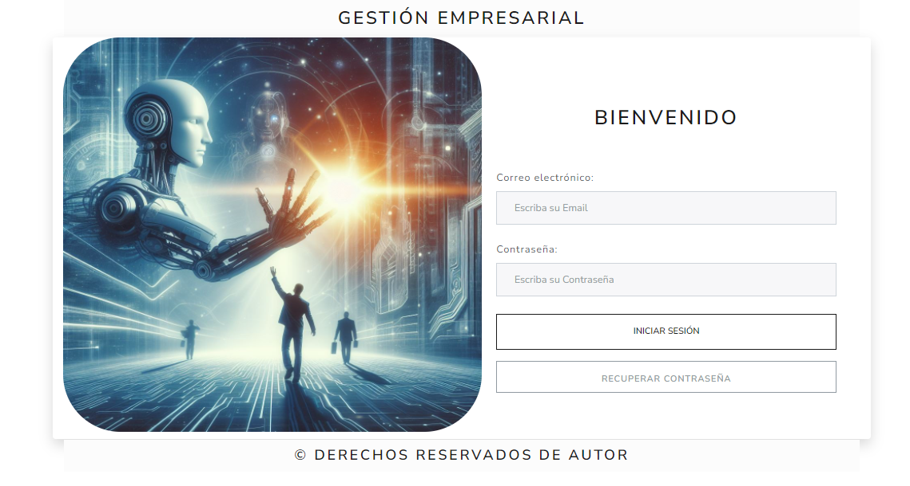

//--------------------------- Gestión Empresarial ------------------------------------------//

El sistema de información esta hecho para llevar el control de una empresa en los módulos de:

1.Creación de Roles. 
2.Creación de Usuarios. 
3.Inventarios. 
4.Recursos Humanos. 
5.Contabilidad. 
6.Ventas. 
7.Reportes. 
8.CRM.

Powered By Jimmy Menjura and Diego Pinzón Software Engineers.

